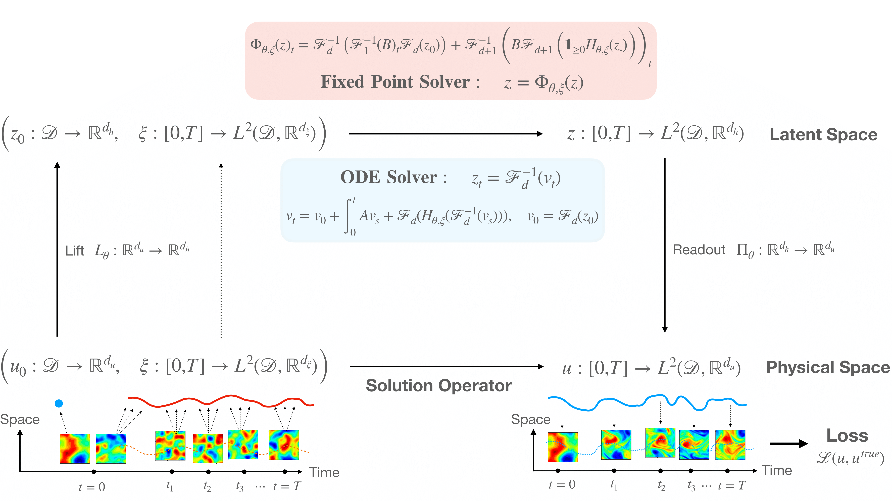

<h1 align='center'>[Neural Stochastic PDEs](https://arxiv.org/abs/2110.10249)</h1>
<h2 align='center'>Resolution-Invariant Learning of Continuous Spatiotemporal Dynamics</h2>

Stochastic partial differential equations (SPDEs) are the mathematical tool of choice for modelling spatiotemporal PDE-dynamics under the influence of randomness. Based on the notion of mild solution of an SPDE, we introduce a novel neural architecture to learn solution operators of PDEs with (possibly stochastic) forcing from partially observed data. Experiments on various semilinear SPDEs, including the stochastic Navier-Stokes equations, demonstrate how the Neural SPDE model is capable of learning complex spatiotemporal dynamics in a resolution-invariant way, with better accuracy and lighter training data requirements compared to alternative models, and up to 3 orders of magnitude faster than traditional solvers.

## Structure of the repository

- `data` folder: contains notebooks to generate various datasets (stochastic Ginzburg Landau, KdV, Navier-Stokes) using numerical solvers for SPDEs (finite difference and spectral Galerkin methods)
- `torchspde` folder: contains the implementation of the Neural SPDE (NSPDE) model
- `baselines` folder: contains the implementation of various models (NCDE, NRDE, FNO and DeepONet) to benchmark NSPDE 
- `examples` folder: contains notebooks to train and evaluate an NSPDE (and baselines models) on different SPDEs (see `example_Ginzburg_Landau.ipynb`), and benchmark the NSPDE model (`example_hyperparameter_grid_search.ipynb`)

## Access to datasets

The datasets for the experiments can be generated using the notebooks in the `data` folder. Alternatively they can be downloaded using the following [link](https://osf.io/ahn6v/?view_only=727fda8358c74ff39a0d5dcfbe2c7b91).
